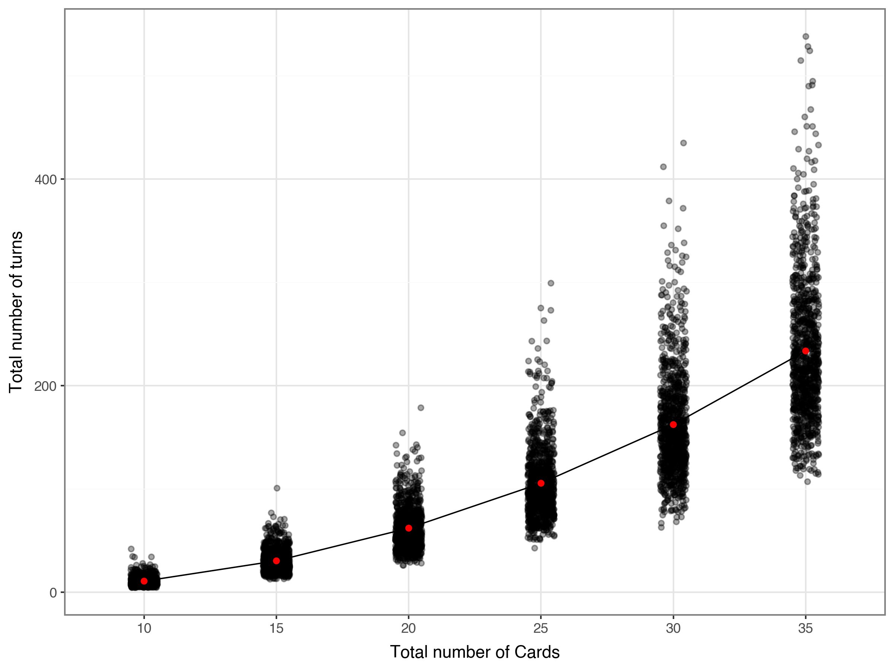

# Slay the spire: How many rounds until you upgrade all your cards

A silly coding project I worked on to practice Python a bit more. It’s based on the card-game/rogue-lite Slay the Spire. When you play as a certain character (the Ironclad), you can get a card called Armaments. At its highest upgrade, the card upgrades all cards in your hand. I was curious how many turns it would take, if you’re drawing randomly from a draw pile, for all your cards to be upgraded!

Well, this is why Armaments is a good early card. As you start increasing the cards in your deck, it takes a lot more turns for you to fully update your deck.